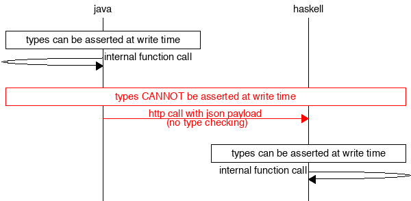

# Gleam Lightening talk

### Gordon Guthrie

---

## Advert Break

17 years on the BEAM, man and boy me hearties

Just laid off from Wayfair and looking for work

Erlang, Elixir, LFE, moar gud stuff


---

## What is Gleam?

Gleam is a statically typed language for the BEAM - interoperable with Erlang and Elixir.

Compiles to Erlang, the compiler is written in Rust.

Super early doors.

---

## Examples - Hello World!

```
pub fn integer_addition(a: Int, b: Int) -> Int {
  a + b
}
```

---

# Examples - First Class Functions

```
// This function takes a function as an argument
pub fn twice(f: fn(t) -> t, x: t) -> t {
  f(f(x))
}

pub fn add_one(x: Int) -> Int {
  x + 1
}

pub fn add_two(x: Int) -> Int {
  twice(add_one, x)
}

pub fn add_one_2(x: Float) -> Float {
  x +. 1.0
}

pub fn add_two_2(x: Float) -> Float {
  twice(add_one_2, x)
}
```

---

# Types on the BEAM: problems

Only a subset of classical `Erlang` can be typed - this also pertains to `gleam`

Phil Wadler tried, Phil Wadler failed.

The problem is concurrency

---

# Limitations of typing in DistSys


